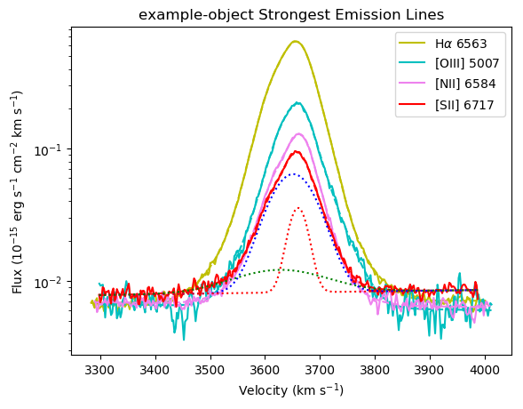
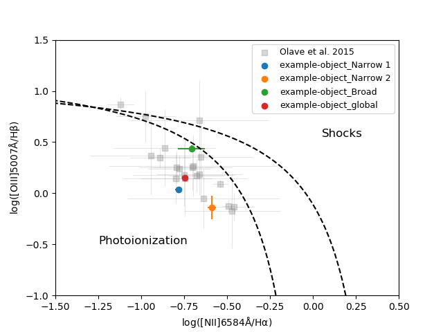
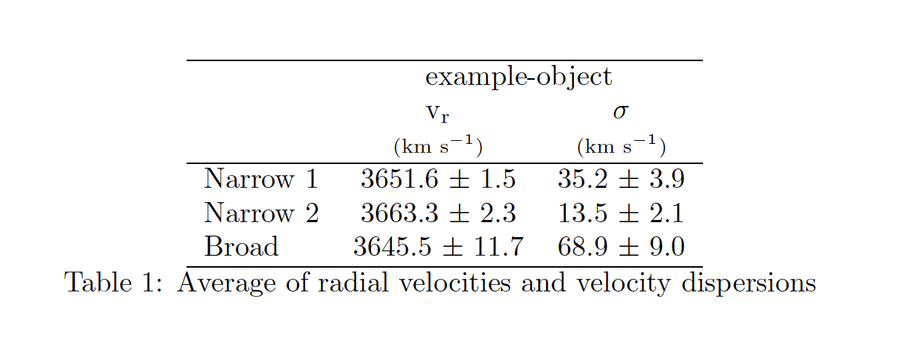
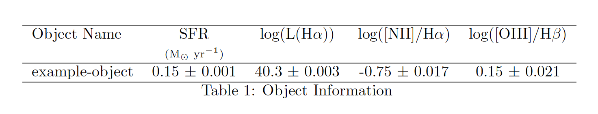

=====
Usage
=====

This package is used to fit emission-lines from echelle or long-slit spectral data with a
continuum and multiple Gaussian components. There are various methods that are useful detailed
in the :ref:`API`. Example usage and analysis tools available are outlined below.

Fit emission-lines profiles
---------------------------
To set-up the properties of an object with multiple emission-lines use the following class.
See :ref:`example` for an example set-up.

* :class:`fitelp.line_profile_info.RegionParameters`

To fit emission-lines in this object use the following method.
See :ref:`example` for an example of how to add emission-lines.

* :func:`fitelp.line_profile_info.RegionParameters.add_em_line`

Compute kinematics of the object
--------------------------------
To perform an analysis on the object use the class.

* :class:`fitelp.kinematics_calculations.RegionCalculations`

Initiating this class will output several plots, tables, and data files about a object.
Examples of outputs are shown below.

A plot of each of the emission-lines fit with as many Gaussian components as specified will be saved.
An example of a fit to a H-alpha emission-line is shown below.

.. image:: Figures/example_H-alpha_fit.png

A table in the form a LaTeX file and a pdf outlining the kinematics of each emission-line will be saved.
An example is shown below.

.. image:: Figures/example_component_table.png

Plot multiple profiles
~~~~~~~~~~~~~~~~~~~~~~
You may plot which ever profiles you wish together using the following function:
See :ref:`example` for an example of using this. An example output plot is also shown below.

* :func:`fitelp.fit_line_profiles.plot_profiles`

Make BPT plot
~~~~~~~~~~~~~
Each object and its components can be added to a BPT plot using the following function.
See :ref:`example` for an example of how to add several objects onto different types of BPT plots.
An example of a BPT plot output is shown below.

* :func:`fitelp.bpt_plotting.bpt_plot` - Make different types of BPT plots

Make table of average velocities
~~~~~~~~~~~~~~~~~~~~~~~~~~~~~~~~
A table (in LaTeX and pdf format) of the average velocities of each components and for each object can be created using
the following function.
An example of this table is shown below.

* :func:`fitelp.make_latex_tables.average_velocities_table_to_latex`

Make table of H-alpha luminosity and SFR
~~~~~~~~~~~~~~~~~~~~~~~~~~~~~~~~~~~~~~~~
A table (in LaTeX and pdf format) of the Star Formation Rate and other information about
the objects can be created using the following function.
An example of this table is shown below.

* :func:`fitelp.make_latex_tables.halpha_regions_table_to_latex`

